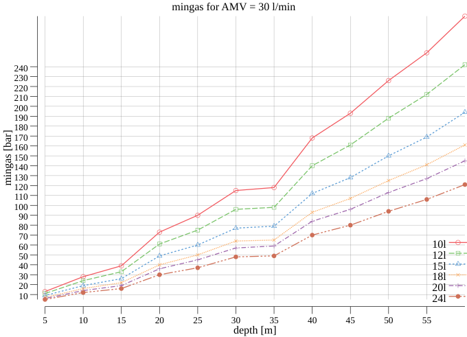

# mingas

## Assumptions

- half depth is always round down to the next "depth mod 3 = 0", e.g. 40m / 2 = 20m -> 18m 
- ascent time to half depth is always round up to the next full minute, e.g. 40m->18m 22m / 10m/min = 2.2 min -> 3 min